A comparison of heuristics to optimise the shortest path for the travelling salesman problem

Candidate Number: 246619

May 16, 2023

1  Introduction

The travelling salesman problem (TSP) is a well known optimisation problem; one where the solver is concerned with finding the shortest route a salesman can take travelling through each city in a given set and then returning to the beginning city. The problem is considered to be NP-Hard, a complexity of problem where it has not been proved to have been solved in polynomial time [1]. The class is defined by problems which are not only hard to solve, but equally hard to verify.

A brute force approach, where each permutation of the journey is found, can solve the problem in factorial time [2]. This approach can become problematic as the set of cities the salesman needs to visit grows. The TSP can be applied to a wide range of real world applications, many in the field of logistics. For example, delivery routes are a pure application of the problem - one that may prioritise speed over an optimal route when calculating a solution.

In this paper I have compared three different approaches to attempt to solve the TSP: a population of hill climbers, a microbial genetic algorithm and ant colony optimisation. These can result in solutions that are calculated much faster than any other brute force or dynamic programming method, but may never result in the optimal solution. I give context to the heuristics, explain their natural inspirations and then go on to define the parameters which performed well in my testing.

My findings show that for a set of fifty cities, ant colony optimisation far out per- forms the other methods tested. It provides near-optimal results extremely quickly, making it my recommendation for any real world application of the TSP.

2  Theoretical Framework
1. Population of Hill Climbers

A hill climber is a simple iterative local search algorithm which seeks to maximise a target fitness function. It starts with a complete configuraton and attempts to improve it by making local transformations [3]. The algorithm will only make a change to the configuration if the new fitness if found to be better than that it achieved previously. Due to this, Hill climbers are notorious for finding local maxima in their result and struggle to find the global optimum, unless they are lucky with their initialisation.

Therefore a population of hill climbers can be used to limit the effects of a hill climber becoming ’stuck’. Multiple randomly initialised hill climbers can ideally spread out across the search space, exploring many local maxima and optimistically leading to the global optimum.

2. Microbial Genetic Algorithm

A genetic algorithm (GA) is a heuristic which borrows many features from the evo- lutionary process [4]. It is similar to a hill climber in the way that a population of genotypes is randomly initialised. The genotype encodes the solution to the problem that the GA is attempting to solve. Commonly this can be in the form of a binary string, but for this research the encoding is a list of indices 0 - 49 which represent each city. Selection of a genotype is made at random, with an opposing combatant then chosen from a local neighbourhood. These two genotypes are then compared by their fitnesses with the winner then ’infecting’ the loser with an intact slice of their genotype [5]. Based on a mutation rate variable, the loser may then be further altered with a swap between the positions of two of their genes.

Here we can see an emulation of the real world evolutionary landscape; survival of the fittest is seen within local communities, whereby losers genes will fade from the population and the fittest will pass on their strong genes. The distinction that makes this a microbial GA is that the winner of the tournament is not altered in any way and thereby elitism is preserved in the population [5].

3. Ant Colony Optimisation

Ant colony optimisation (ACO) is a novel approach which takes inspiration from the behaviour of foraging ants. In experimentation conducted by Deneubourg et al [6] it was found that Argentine ants when exploring chemically unmarked territory, do so in a random fashion. Once a food source is stumbled upon, an ant will return to the nest leaving a pheromone trail along the ground. Other ants then pick up on this trail, further increasing the pheromone concentration. As a result of the positive feedback loop, it was found that ants are likely to converge on the shortest path between the food source and their nest [7].

A population of ants are each randomly placed at a different city at each iteration of the algorithm. They then must complete a tour by iteratively choosing the next city to travel to. Each city is given a weighted random chance to be picked next which is based on the distance from the ants current city and the amount of pheromones found on the edge connecting the cities. After one iteration, the amount of pheromone on an edge decays, this results in the longest and least used paths to be poorly weighted as a potential route for an ant to take.

3  Methods

To compare the three heuristics, a set of 50 cities were used throughout testing as seen in Figure 1. The x, y coordinates were randomly chosen from an inverse Gaussian distribution to promote cities around the edge of the 2002 area. The fitness function used to evaluate the approaches is the total distance travelled when making a tour through each city and finally travelling back to the initial starting city.

The population of each heuristic was set at 20 and each method ran for 1000 iterations with the final results being an average over 5 runs. Both the Microbial GA and ant colony optimisation required additional parameters which I will cover in the next section.

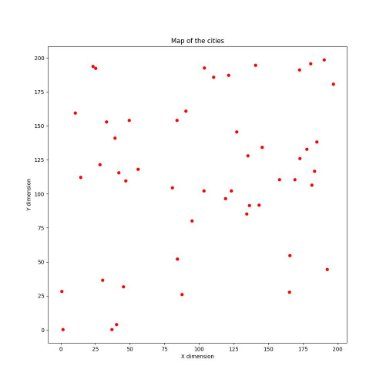

Figure 1: A plot of the 50 cities

1. Genetic Algorithm

Each iteration of the the microbial genetic algorithm saw the same number of tour- naments as genotypes within the population. I found the best performance from the GA with a local neighbourhood size of 2 - whereby a combatant is randomly picked in a 2 index window around the first randomly chosen genotype for a tournament. A mutation rate of 1 was chosen, so that the loser of the combatants is always mutated by swapping two of the gene locations.

When a winner is chosen between the two combatants, 25 genes are transferred from the winner to the loser. As the genotype represents the order of the cities, I was not able to simply overwrite the genes of the loser with the winners as common when using a binary genotype. Instead a more sophisticated approach was needed, as such I chose to use the partially mapped crossover as proposed by Goldberg and Lingle [8].

A randomly chosen window within the winner is copied over to a newly made child gentoype, respecting the original indices. A map is made between the winner and the losers window which is then used to legally fill the child with no duplication. Finally the child genotype overwrites the loser genotype within the population. This crossover procedure is outlined in Figure 2.

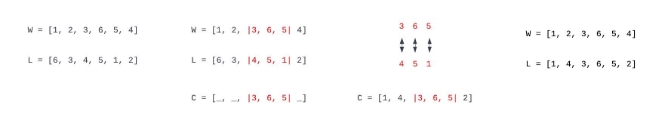

Figure 2: Example of the Partially Mapped Crossover performed on two integer genotypes

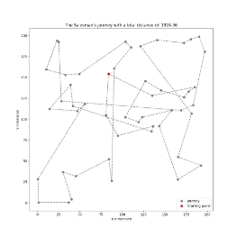 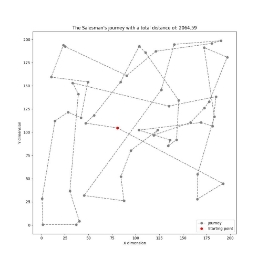 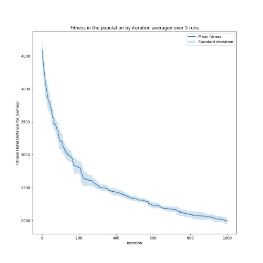

Figure 3: Best tour after 1000 iterations Figure 4: Worst tour after 1000 iterations Figure 5: Mean fitness per iteration

Hill Climber performance

2. Ant Colony Optimisation

To extract the best performance from the ACO, I chose to use the parameters as proposed by Dorigo et al [9]:

- α - 1: the relative importance of the pheromone trail
- β - 5: the relative importance of the distance between the cities
- Decay - 0.5: the evaporation of the pheromone trail every iteration
- Q - 100: the quantity of pheromone dropped by the ants
4  Results

Averaged over five runs, the population of hill climbers achieved a final fitness after 1000 iterations of 1989.33. The standard deviation from the mean final fitness was 51.53. Figure 5 shows both of these metrics plotted per iteration. The best single tour found by the population of hill climbers was 1924.36 as shown in Figure 3. Averaged over five runs, the microbial GA completed the 1000 iterations with a fitness of 1907.85 and a standard deviation of 134.42. The single best tour found was that in Figure 6 with a fitness of 1668.23.

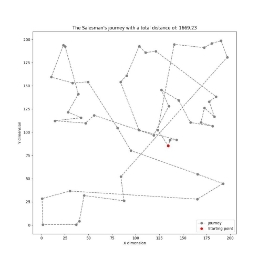 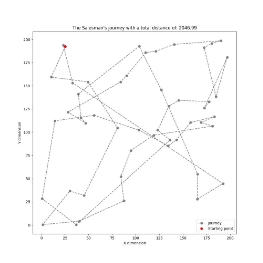 

Figure 6: Best tour after 1000 iterations Figure 7: Worst tour after 1000 iterations Figure 8: Mean fitness per iteration

Microbial Genetic Algorithm performance

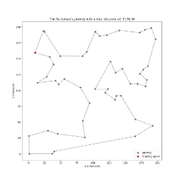 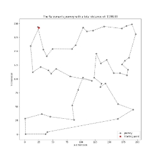 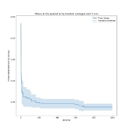

Figure 9: Best tour after 1000 iterations Figure 10: Worst tour after 1000 iterations Figure 11: Mean fitness per iteration Ant Colony Optimisation performance

Averaged over five runs, ant colony optimisation achieved a final fitness of 1188.03 with a standard deviation of 8. The single best tour produced was that found in Figure 9 with a fitness of 1176.56. The worst tour produced was that in Figure 10 with a fitness of 1198.03; a difference of 21.47 from the best result.

5  Discussion

As expected, the hill climber performed the worse of the three methods. Analysing the trend of the graph 3, I believe there was still further improvement on the table, but ultimately the algorithm takes too long and is unlikely to provide an optimal tour. The greedy approach that a hill climber takes can mean that it is possible to quickly converge on a result, but it is then likely to miss global optima. I believe this to be evident in the results I have found. Possibly a population of more hill climbers would allow for a better chance of avoiding local minima.

The GA performed marginally better than the hill climber when averaged over 5 runs as can be seen in Figure 12. It did however produce greatly varied results, whereas the hill climbers were generally more consistent. As shown in Figure 8 the standard deviation was considerably greater throughout the iterations; this would

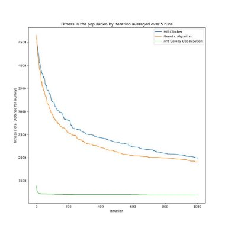

Figure 12: A comparison of the mean fitness for all methods

be evidence that the random initialisation of the population was of great importance for the GA to escape from the local minima. Overall the microbial GA performed disappointingly especially when compared with the added complexity to the hill climbers.

By far the best heuristic to solve the TSP is ant colony optimisation. As shown in Figure 9, the result appears to be near optimal. It was also able to quickly converge and produce great results after only 200 iterations as shown by Figure 11, usually only marginally improving after this. Computationally ACO was the most demanding of the three heuristics, with an iteration taking up to five times as long compared to the previous methods. This is however can be alleviated by the reduced amount of iterations needed to produce great results.

5\.1 Reflection

To further extend the work in this paper, I would have liked to have experimented with other combatant selection methods for the microbial GA. Both roulette selection and rank-based selection have been found to result in better performance for the TSP [10].

Additionally I believe there is further opportunity to experiment with the number of cities contained in the problem. It would be interesting to see if ACO performs as dominantly at problems which are smaller or larger in scope.

Finally, I would have liked to been able to compare the calculated journeys with the true optimal solution for the TSP in this experiment. I did attempt to find the solution using the Held-Karp algorithm, but I was not able to dedicate the full time needed for the algorithm to run. It did allow me to appreciate the complexity of the problem and the ingenuity of the ACO heuristic that performs so well.

6  Conclusion

In conclusion, this paper has presented a comparison between three different opti- misation techniques to attempt to solve the travelling salesman problem. I submit that ant colony optimisation the best algorithm to use; resulting in an average 62% improvement in journey length over the next best heuristic. Additionally ACO con- verged far quicker to near optimal results, such that it is impossible to recommend the use of hill climbers or microbial genetic algorithms in the form used for this problem.

References

1. Shabnam Sangwan. Literature review on travelling salesman problem. Interna- tional Journal of Research, 5:1152, 06 2018.
1. Amey Gohil, Manan Tayal, Tezan Sahu, and Vyankatesh Sawalpurkar. Travel- ling salesman problem: Parallel implementations analysis, 2022.
1. E.-G. Talbi and T. Muntean. Hill-climbing, simulated annealing and genetic al- gorithms: a comparative study and application to the mapping problem. ii:565– 573 vol.2, 1993.
1. Samreen Umer. Investigation into mutation operators for microbial genetic algo- rithm. In 2015 7th International Joint Conference on Computational Intelligence (IJCCI), volume 1, pages 299–305, 2015.
1. Inman Harvey. The microbial genetic algorithm. pages 126–133, 2011.
1. Jean-Louis Deneubourg, Serge Aron, S. Goss, and Jacques Pasteels. The self- organizing exploratory pattern of the argentine ant. J. Insect Behav., 3:159, 03 1990.
1. Marco Dorigo, Mauro Birattari, and Thomas Stutzle. Ant colony optimization. IEEE Computational Intelligence Magazine, 1(4):28–39, 2006.
1. D E Goldberg and R Lingle. Alleles, loci, and the traveling salesman problem. In Proceedings of the first international conference on genetic algorithms and their applications, pages 154–159. Psychology Press, 1985.
1. M. Dorigo, V. Maniezzo, and A. Colorni. Ant system: optimization by a colony of cooperating agents. IEEE Transactions on Systems, Man, and Cybernetics, Part B (Cybernetics), 26(1):29–41, 1996.
1. Hari Mohan Pandey. Performance evaluation of selection methods of genetic algorithm and network security concerns. Procedia Computer Science, 78:13– 18, 2016. 1st International Conference on Information Security Privacy 2015.
7
